# ApnaSamaj – Entity Relationship Diagram

## Architecture Overview

**Isolation Strategy:** Row-level multi-tenancy via `tenant_id` FK on every table.
**Primary Keys:** UUID v4 (database-generated).
**Soft Delete:** `is_deleted` + `deleted_at` on all tables.
**Audit Columns:** `created_at`, `updated_at`, `created_by`, `updated_by`.

## ER Diagram

```mermaid
erDiagram
    tenants {
        uuid id PK
        varchar name
        varchar slug UK
        text description
        varchar email
        varchar phone
        varchar primary_language
        varchar timezone
        varchar currency
        jsonb social_links
        jsonb settings
        boolean is_active
    }

    users {
        uuid id PK
        varchar mobile UK
        varchar email UK
        varchar full_name
        boolean is_active
        boolean is_verified
        boolean is_super_admin
        varchar google_id UK
        varchar apple_id UK
        timestamp last_login_at
    }

    user_sessions {
        uuid id PK
        uuid user_id FK
        uuid tenant_id FK
        varchar device_name
        varchar device_type
        varchar ip_address
        varchar refresh_token_hash
        boolean is_revoked
        timestamp expires_at
        timestamp last_used_at
    }

    otp_records {
        uuid id PK
        varchar mobile
        varchar otp_hash
        varchar purpose
        int attempts
        boolean is_verified
        timestamp expires_at
    }

    roles {
        uuid id PK
        uuid tenant_id FK "nullable - null means system role"
        varchar name
        varchar display_name
        boolean is_system
    }

    permissions {
        uuid id PK
        varchar code UK
        varchar display_name
        varchar module
    }

    role_permissions {
        uuid id PK
        uuid role_id FK
        uuid permission_id FK
    }

    user_tenant_roles {
        uuid id PK
        uuid user_id FK
        uuid tenant_id FK
        uuid role_id FK
        boolean is_active
    }

    members {
        uuid id PK
        uuid tenant_id FK
        uuid user_id FK "nullable"
        uuid family_id FK "nullable"
        varchar first_name
        varchar last_name
        varchar gender
        date date_of_birth
        varchar occupation
        varchar blood_group
        varchar email
        varchar mobile
        varchar status "active|inactive|deceased|migrated"
        varchar membership_number UK
    }

    families {
        uuid id PK
        uuid tenant_id FK
        varchar name
        varchar family_code UK
        uuid family_head_id FK
    }

    family_members {
        uuid id PK
        uuid tenant_id FK
        uuid family_id FK
        uuid member_id FK
        uuid related_to_member_id FK "nullable"
        varchar relationship_type
        int generation
    }

    committees {
        uuid id PK
        uuid tenant_id FK
        varchar name
        date term_start
        date term_end
        varchar status
    }

    committee_members {
        uuid id PK
        uuid tenant_id FK
        uuid committee_id FK
        uuid member_id FK
        varchar position
        varchar status
    }

    donations {
        uuid id PK
        uuid tenant_id FK
        uuid member_id FK "nullable"
        uuid family_id FK "nullable"
        uuid event_id FK "nullable"
        decimal amount
        date donation_date
        varchar purpose
        varchar payment_mode
        varchar receipt_number UK
        varchar status
    }

    events {
        uuid id PK
        uuid tenant_id FK
        varchar title
        varchar event_type
        date start_date
        date end_date
        varchar venue
        boolean is_registration_open
        int max_attendees
        varchar status
        uuid organizer_id FK
        uuid committee_id FK
    }

    event_registrations {
        uuid id PK
        uuid tenant_id FK
        uuid event_id FK
        uuid member_id FK
        varchar status
        timestamp checked_in_at
        varchar check_in_method
    }

    volunteers {
        uuid id PK
        uuid tenant_id FK
        uuid member_id FK
        jsonb skills
        varchar availability
        decimal total_hours
        int total_events
    }

    volunteer_assignments {
        uuid id PK
        uuid tenant_id FK
        uuid volunteer_id FK
        uuid event_id FK
        varchar role
        decimal hours
        boolean attended
    }

    complaints {
        uuid id PK
        uuid tenant_id FK
        varchar complaint_number UK
        uuid raised_by_id FK
        uuid assigned_to_id FK "nullable"
        varchar title
        varchar category
        varchar priority
        varchar status
        text resolution
    }

    documents {
        uuid id PK
        uuid tenant_id FK
        uuid uploaded_by_id FK
        varchar entity_type
        uuid entity_id
        varchar file_name
        varchar file_type
        bigint file_size
        varchar file_url
    }

    notification_templates {
        uuid id PK
        uuid tenant_id FK
        varchar name UK
        varchar channel
        text body_template
        boolean is_active
    }

    notifications {
        uuid id PK
        uuid tenant_id FK
        uuid user_id FK "nullable"
        uuid member_id FK "nullable"
        varchar title
        text body
        varchar channel
        boolean is_read
        boolean is_sent
    }

    audit_logs {
        uuid id PK
        uuid tenant_id FK
        uuid user_id FK "nullable"
        varchar action
        varchar entity_type
        uuid entity_id
        jsonb old_values
        jsonb new_values
        timestamp performed_at
    }

    %% ── Relationships ──────────────────────────────────────────────

    tenants ||--o{ members : "has"
    tenants ||--o{ families : "has"
    tenants ||--o{ committees : "has"
    tenants ||--o{ donations : "has"
    tenants ||--o{ events : "has"
    tenants ||--o{ volunteers : "has"
    tenants ||--o{ complaints : "has"
    tenants ||--o{ documents : "has"
    tenants ||--o{ notifications : "has"
    tenants ||--o{ audit_logs : "has"
    tenants ||--o{ user_tenant_roles : "has"
    tenants ||--o{ roles : "custom roles"

    users ||--o{ user_sessions : "has"
    users ||--o{ user_tenant_roles : "assigned"
    users ||--o{ notifications : "receives"

    roles ||--o{ role_permissions : "grants"
    permissions ||--o{ role_permissions : "granted via"
    roles ||--o{ user_tenant_roles : "assigned to"

    members ||--o{ donations : "makes"
    members ||--o{ event_registrations : "registers"
    members ||--o{ family_members : "belongs to"
    members ||--o{ committee_members : "serves on"
    members ||--o{ complaints : "raises"
    members ||--o{ notifications : "receives"

    families ||--o{ members : "contains"
    families ||--o{ family_members : "has"
    families ||--o{ donations : "receives from"

    committees ||--o{ committee_members : "has"
    committees ||--o{ events : "organizes"

    events ||--o{ event_registrations : "has"
    events ||--o{ volunteer_assignments : "has"
    events ||--o{ donations : "linked to"

    volunteers ||--o{ volunteer_assignments : "assigned to"
```

## Table Summary

| Table | Scope | Description |
|-------|-------|-------------|
| `tenants` | Global | Community/organization registry |
| `users` | Global | User accounts (authentication) |
| `user_sessions` | Global | Device session management |
| `otp_records` | Global | Ephemeral OTP storage |
| `roles` | Global + Tenant | System and custom roles |
| `permissions` | Global | Permission definitions |
| `role_permissions` | Global | Role ↔ Permission mapping |
| `user_tenant_roles` | Global | User ↔ Tenant ↔ Role mapping |
| `members` | Tenant | Community member profiles |
| `families` | Tenant | Family units |
| `family_members` | Tenant | Family ↔ Member with relationships |
| `committees` | Tenant | Governing committees |
| `committee_members` | Tenant | Committee ↔ Member with positions |
| `donations` | Tenant | Financial contributions |
| `events` | Tenant | Community events |
| `event_registrations` | Tenant | Event ↔ Member registrations |
| `volunteers` | Tenant | Volunteer profiles |
| `volunteer_assignments` | Tenant | Volunteer ↔ Event assignments |
| `complaints` | Tenant | Grievance tracking |
| `documents` | Tenant | File/document storage metadata |
| `notification_templates` | Tenant | Reusable notification templates |
| `notifications` | Tenant | Individual notifications |
| `audit_logs` | Tenant | Immutable audit trail |

**Total: 23 tables**
