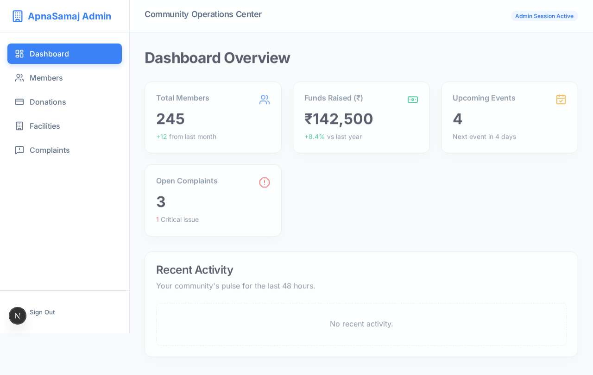

# ApnaSamaj Documentation

Welcome to the **ApnaSamaj** open-source community management platform documentation.

## What is ApnaSamaj?

ApnaSamaj is an enterprise-ready digital platform designed to completely digitize residential communities, housing societies, and non-profits.

### Core Features
- **Member Directory**: Securely manage members and families.
- **Event & RSVP Engine**: Schedule community gatherings and track attendees.
- **Facility Booking**: Collision-free asset reservations (e.g. Community Halls, Sports Courts).
- **Complaints & Ticketing**: Dedicated helpdesk routing issues to specific committees.
- **Polling & Surveys**: Cryptographically secure, one-vote-per-member community voting.
- **Omnichannel Broadcasting**: Push, SMS, and Email integrations.
- **Payments Engine**: Vendor-agnostic webhooks handling Stripe/Razorpay donations.

---

## The Tech Stack

ApnaSamaj is built on a modern, decoupled monorepo architecture:

1. **Backend**: FastAPI (Python), PostgreSQL, Redis, MinIO
2. **Web Admin**: Next.js 14 App Router (Vanilla CSS, Glassmorphism)
3. **Mobile App**: Expo / React Native

To get started, see the [Getting Started](getting-started.md) guide.
